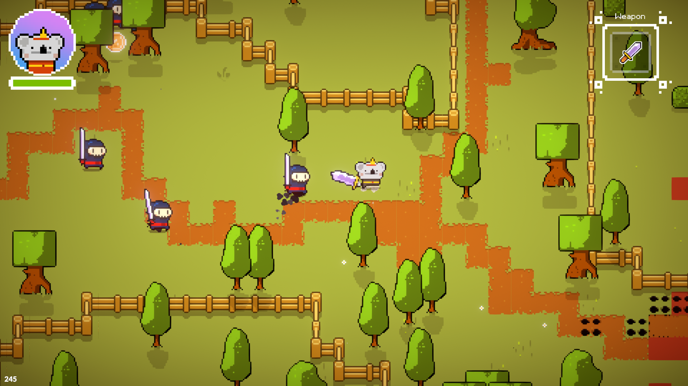

# Thesis - Player Preference Extraction From In-Game Behavior

A Marsupial's Adventure is the game I developed for my thesis. It is based on [TopDownEngine](https://assetstore.unity.com/packages/templates/systems/topdown-engine-89636), but most systems received changes to accommodate my goals and improve player experience.

## Experiment

To participate in the experiment please go to the [website](http://web.ist.utl.pt/ist186383/) linked here.

You will answer the BrainHex questionnaire and a UID will be given to you at the end.

Download the game from the link provided at the end of the questionnaire and type your UID inside the game in the appropriate field.

## Final Report

~~Once I finish writing the final report it will be made available here.~~
